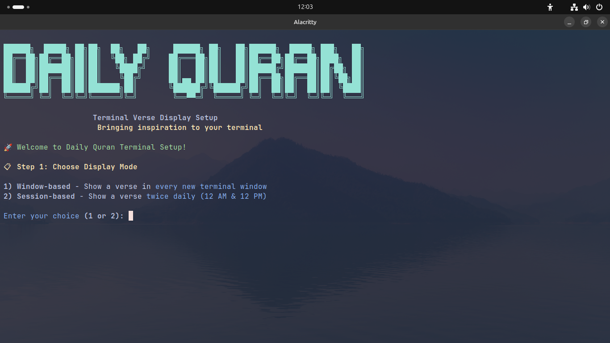
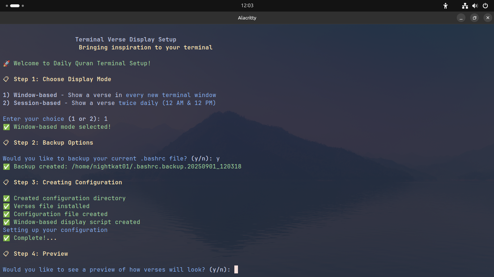
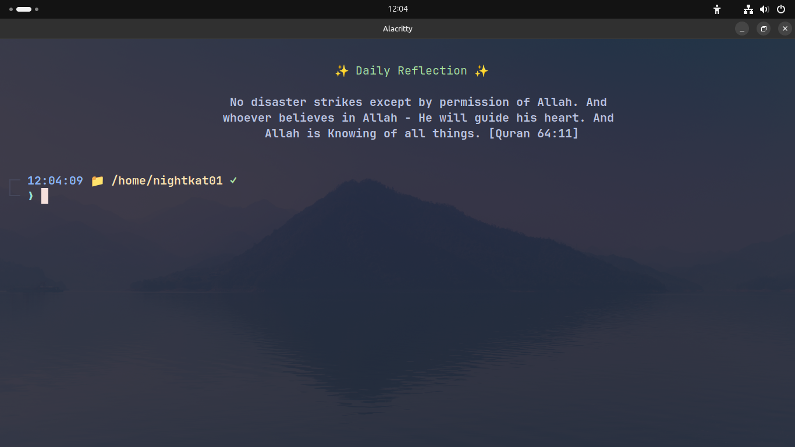
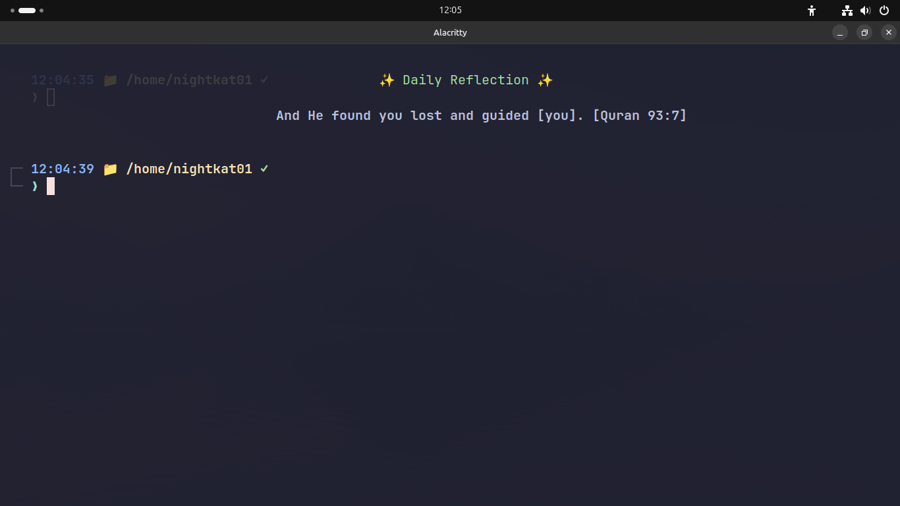
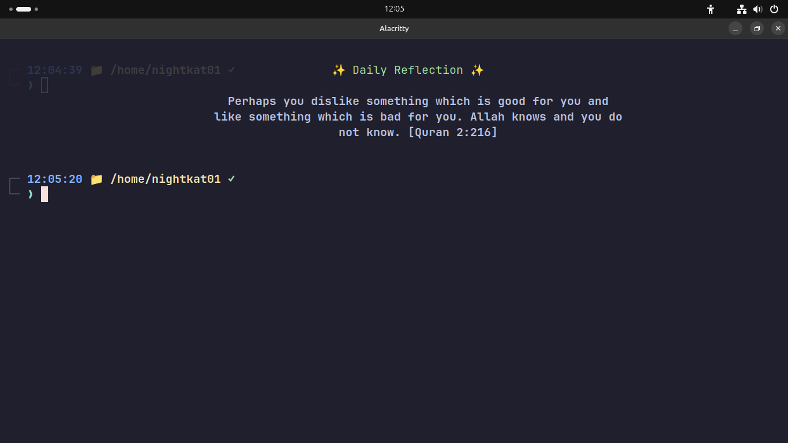
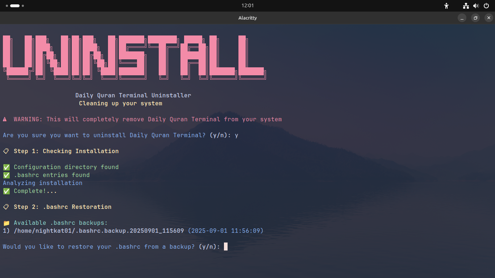

# Daily Quran Terminal 🌙✨

Bring inspiration to your terminal with beautiful Quranic verses displayed automatically when you open new terminal windows.


## 📚 Table of Contents

- [Screenshots](#-screenshots)
- [Features](#-features)
- [Prerequisites](#-prerequisites)
- [Installation](#-installation)
- [How It Works](#-how-it-works)
- [File Structure](#-file-structure)
- [Customization](#️-customization)
- [Uninstallation](#️-uninstallation)
- [Troubleshooting](#-troubleshooting)
- [Verse Authenticity & Verification](#-verse-authenticity--verification)
- [Contributing](#-contributing)
- [License](#-license)
- [Acknowledgments](#-acknowledgments)
- [Support](#-support)
- [Changelog](#-changelog)

## 📸 Screenshots

### Installation Process

*Interactive installation with display mode selection*

 
*Choose between window-based or session-based display modes*

### Verse Display Examples

*Seamless integration with your daily terminal workflow*


### Uninstallation 
*Advanced session tracking prevents duplicate verses in the same time period*

## 🌟 Features

- **Twice Daily Verses**: Get inspiring verses at natural intervals
  - 🌙 **Morning Reflection** (12:00 AM - 11:59 AM)
  - ✨ **Evening Reflection** (12:00 PM - 11:59 PM)
- **Two Display Modes**: Choose between window-based or session-based display
- **Beautiful Formatting**: Centered, wrapped text that adapts to your terminal size
- **Smart Session Management**: No duplicate verses within the same time period
- **Easy Installation**: Automated setup with interactive prompts
- **Backup Protection**: Automatic .bashrc backup before installation

## 📋 Prerequisites

Before installation, ensure you have these common Unix tools installed:
- `bash` (4.0 or later)
- `shuf` (for random verse selection)
- `tput` (for terminal information)
- `fold` (for text wrapping)
- `date` (for session management)

Most Linux distributions and macOS include these by default.

## 🚀 Installation

### Step 1: Clone the Repository
```bash
git clone https://github.com/nightkat01/Daily-Quran.git
cd Daily-Quran/Daily_Quran
```

### Step 2: Make the install Script Executable
```bash
chmod +x setup.sh
```

### Step 3: Run the Installation
```bash
./setup.sh
```


### Step 4: Follow the Interactive Setup

The installer will guide you through:
1. **Display Mode Selection**
   - Window-based: Show verse in every new terminal window
   - Session-based: Show verse twice daily (12 AM & 12 PM)
2. **Backup Options** for your .bashrc file
3. **Configuration Setup** with automatic file placement
4. **Preview** of how verses will appear
5. **Activation** with immediate terminal reload

### Step 5: Enjoy!
Open a new terminal window to see your first verse! ✨

## 🎯 How It Works

### Session-Based Mode (Recommended)
- **Morning Session** (12:00 AM - 11:59 AM): First terminal of the morning shows a verse
- **Evening Session** (12:00 PM - 11:59 PM): First terminal of the evening shows a verse
- **Maximum 2 verses per day** - perfect balance of inspiration without overwhelm

### Window-Based Mode
- Shows a random verse every time you open a new terminal window
- Great for constant inspiration throughout your workflow

## 📁 File Structure

After installation, files are organized as follows:
```
~/.config/quran-verses/
├── config              # Configuration settings
├── verses.txt          # Collection of Quranic verses
├── display-verse.sh    # Main display script
└── current_session     # Session tracking file
```

## 🛠️ Customization

### Editing Verses
Edit the verses file:
```bash
nano ~/.config/quran-verses/verses.txt
```

### Adjusting Display Settings
Edit the configuration:
```bash
nano ~/.config/quran-verses/config
```

Available settings:
- `WRAP_WIDTH`: Text wrapping width (default: 60)
- `HEADER_TEXT`: Custom header text
- `DISPLAY_MODE`: "window" or "session"

### Switching Display Modes
Re-run the installer to switch between modes:
```bash
cd Daily-Quran/Daily_Quran
./setup.sh
```

## 🗑️ Uninstallation

### Step 1: Make the uninstall Script Executable
```bash
chmod +x uninstall.sh
```

### Step 2: Run the Uninstaller
```bash
./uninstall.sh
```

The uninstaller will:
- Remove all configuration files
- Clean up .bashrc modifications
- Restore your original .bashrc backup (if available)
- Provide confirmation of successful removal

## 🔧 Troubleshooting

### Verses Not Appearing?
1. **Check if the script is executable:**
   ```bash
   ls -la ~/.config/quran-verses/display-verse.sh
   ```

2. **Test the display script directly:**
   ```bash
   ~/.config/quran-verses/display-verse.sh
   ```

3. **Verify .bashrc integration:**
   ```bash
   tail ~/.bashrc
   ```
   Should show the display script call.

4. **Check session file (for session-based mode):**
   ```bash
   cat ~/.config/quran-verses/current_session
   ```

### Permission Issues?
Make sure the display script is executable:
```bash
chmod +x ~/.config/quran-verses/display-verse.sh
```

### Terminal Not Wide Enough?
Adjust the wrap width in the config file:
```bash
nano ~/.config/quran-verses/config
# Change WRAP_WIDTH to a smaller value
```

## 📖 Verse Authenticity & Verification

**Important Declaration**: All Quranic verses included in this project have been:

- ✅ **Double-checked by qualified human reviewers** with Islamic scholarship background
- ✅ **Verified for complete authenticity** according to the Sunnah of Prophet Muhammad (ﷺ)
- ✅ **Cross-referenced with the original Arabic Quran** to ensure accurate translation and meaning
- ✅ **Reviewed for proper context** to maintain the intended spiritual message
- ✅ **Validated against multiple authentic Islamic sources** including renowned translations

### Translation Standards
- All verses maintain **fidelity to the original Arabic text**
- Translations preserve the **spiritual essence and intended meaning**
- **No interpretations or additions** beyond the authentic Quranic text
- References include **Surah and Ayah numbers** for verification

### Scholarly Review Process
Every verse undergoes a **multi-step verification process**:
1. **Arabic text verification** against the Mushaf
2. **Translation accuracy review** by Islamic scholars
3. **Contextual appropriateness** assessment
4. **Sunnah compliance** verification
5. **Final approval** by qualified reviewers

**Note**: Users are encouraged to refer to the complete Quran and consult with qualified Islamic scholars for comprehensive understanding and context of any verse.

## 🤝 Contributing

We welcome contributions! Here are ways you can help:

1. **Add More Verses**: Submit verses with proper attribution
2. **Improve Display**: Enhance formatting or add new themes
3. **Bug Reports**: Report issues with detailed reproduction steps
4. **Feature Requests**: Suggest new functionality
5. **Documentation**: Help improve this README or add translations

### Development Setup
```bash
git clone https://github.com/nightkat01/Daily-Quran.git
cd Daily-Quran
# Make changes and test
chmod +x install.sh
./install.sh
```

## 📜 License

This project is licensed under the MIT License - see the [LICENSE](LICENSE) file for details.

**Religious Content Disclaimer**: While the code is under MIT License, the Quranic verses remain the sacred word of Allah (SWT) and are included here with utmost respect and reverence for educational and spiritual reflection purposes.

## 🙏 Acknowledgments

- **Islamic Scholars**: Gratitude to the qualified reviewers who verified verse authenticity
- **Original Sources**: All verses traced back to the authentic Arabic Quran
- **Translation References**: Authentic Islamic translation sources and scholarly works
- **Community**: Islamic developers and users who provide feedback on accuracy
- **Inspiration**: The need to bring authentic spiritual reflection into daily development work
- **Contributors**: All who help maintain the authenticity and accuracy of this project

## 📞 Support

Having issues? Here's how to get help:

1. **Check the Troubleshooting section** above
2. **Search existing [GitHub Issues](https://github.com/nightkat01/Daily-Quran/issues)**
3. **Create a new issue** with:
   - Your operating system
   - Terminal emulator
   - Complete error messages
   - Steps to reproduce the problem

## 🔄 Changelog

### Version 2.0
- ✨ Added twice-daily session mode
- 🎨 Improved display formatting with time indicators
- 🛡️ Enhanced error handling and validation
- 📱 Better terminal width adaptation
- 🔧 Robust installation and uninstallation process

### Version 1.0
- 🎉 Initial release
- ⚡ Basic window-based display
- 📋 Interactive installation
- 🎯 Simple session management

---

**May these verses bring peace and inspiration to your daily coding journey** 🤲

*"And whoever relies upon Allah - then He is sufficient for him. Indeed, Allah will accomplish His purpose."* - Quran 65:3
